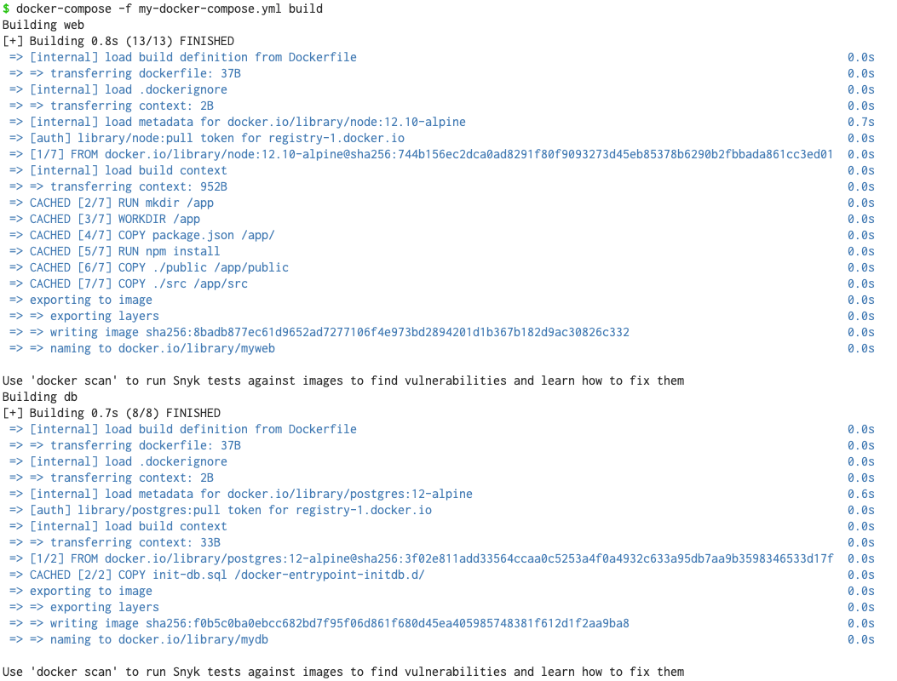
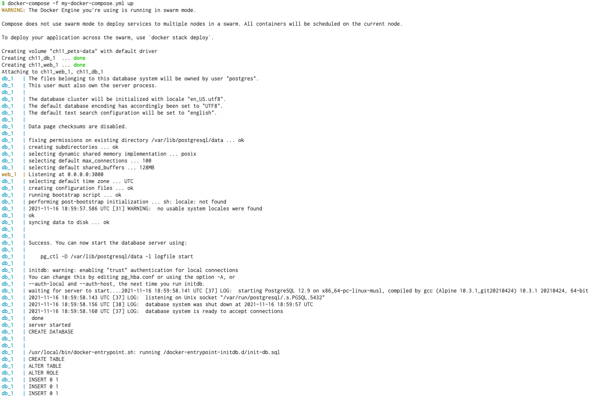
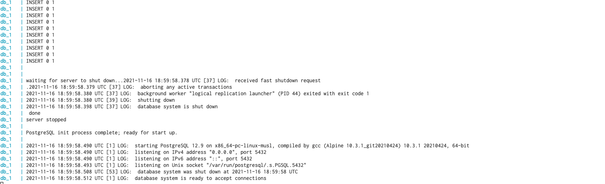

# Chapter 11 Docker Compose

How to do a clean restart of a Docker instance [1]

```
docker-compose -f my-docker-compose down
docker volume rm $(docker volume ls -q)
```

The above can be combined into one command:

```
docker-compose -f my-docker-compose.yml down -v
```

don't forget to clean up:

```
docker rm -f $(docker ps -a -q)
docker rmi $(docker images -q)
```

### Get it to work:

file: my-docker-compose.yml

```
version: "2.4"
services:
  web:              # name of the service
    image: myweb    # if not already in the image cache, it is built from the Dockerfile specify at the location (next line)
    build: web      # the path to Dockerfile folder
    ports:          # This field take a list of port mapping
      - 3000:3000
  db:
    image: mydb
    build: database
    volumes:
      - pets-data:/var/lib/postgresql/data      # mapping:
                                                #   <name>:<path of the volume mounted inside container>
volumes:
  pets-data:   # name of the volume
               # A volume called pets-data will be created by Docker and then,
               # in subsequent runs, if the volume is still there, it will be
               # reused. This could be important when the application, for some
               # reason, crashes and has to be restarted. Then, the previous data
               # is still around and ready to be used by the restarted database
               # service.

```

---
### build image

To build the images specified in the `build` field above:

```
docker-compose -f my-docker-compose.yml build
```



---

Verify that images has been created:

```
$ docker images
REPOSITORY   TAG       IMAGE ID       CREATED          SIZE
mydb         latest    f0b5c0ba0ebc   23 minutes ago   194MB
myweb        latest    8badb877ec61   23 minutes ago   95.6MB
```

---

### up

```
docker-compose -f my-docker-compose.yml up
```




Note that
- a volume being created, but didn't.
- a bridge network is created.
- the two services, ch11_web_1 and ch11_db_1, and attaches them to the network
- web is listening at 0.0.0.0:3000
- the database initialization with script `initdb.sql` which defines
 a database and seeds it with some data.




---

Check that there are two containers running:

```
docker ps
CONTAINER ID   IMAGE     COMMAND                  CREATED         STATUS         PORTS                    NAMES
285fc5feb9b2   mydb      "docker-entrypoint.s…"   9 minutes ago   Up 9 minutes   5432/tcp                 ch11_db_1
d769b0eebd70   myweb     "docker-entrypoint.s…"   9 minutes ago   Up 9 minutes   0.0.0.0:3000->3000/tcp   ch11_web_1
```

---

### Check that it is working:

```
curl -i 0.0.0.0:3000/pet
HTTP/1.1 200 OK
X-Powered-By: Express
Content-Type: text/html; charset=utf-8
Content-Length: 383
ETag: W/"17f-bH3nhWyJ0B+BW1ZPVifxC2WF1zs"
Date: Tue, 16 Nov 2021 19:10:25 GMT
Connection: keep-alive

<html>
<head>
    <link rel="stylesheet" href="css/main.css">
</head>
<body>
    <div class="container">
        <h4>Animal of the day</h4>
        
        <p><small>Photo taken at <a href="https://www.maasaimara.com/">Massai Mara National Park</a></small></p>
        <p>Delivered to you by container d769b0eebd70<p>
    </div>
</body>
</html>
```
---

### Inpect the volume

To inpect the volume use [2]:

```
docker inspect -f '{{ .Mounts }}' 285fc5feb9b2
[{volume ch11_pets-data /var/lib/docker/volumes/ch11_pets-data/_data /var/lib/postgresql/data local rw true }]
```

Docker volumes are created to share data within different
containers, rather than sharing data with host and container.


Note that you can see the mount point, however you cannot access it directly.
That is because it is located inside the vm that docker instantiates
to provide the necessary Linux environment [3]; however, you have
access to the volume from inside the container:

```
docker exec -it 285fc5feb9b2 sh
/ # cd /var/lib/postgresql/data/
/var/lib/postgresql/data # ls -l
total 124
-rw-------    1 postgres postgres         3 Nov 16 18:59 PG_VERSION
drwx------    6 postgres postgres      4096 Nov 16 18:59 base
drwx------    2 postgres postgres      4096 Nov 16 19:00 global
drwx------    2 postgres postgres      4096 Nov 16 18:59 pg_commit_ts
drwx------    2 postgres postgres      4096 Nov 16 18:59 pg_dynshmem
-rw-------    1 postgres postgres      4782 Nov 16 18:59 pg_hba.conf
-rw-------    1 postgres postgres      1636 Nov 16 18:59 pg_ident.conf
drwx------    4 postgres postgres      4096 Nov 16 19:04 pg_logical
drwx------    4 postgres postgres      4096 Nov 16 18:59 pg_multixact
...
...
```

Why is there a `ch11` prefix in the name of the volume?
In the `my-docker-compose.yml` file, we have called the volume
to use `pets-data`. But, Docker Compose prefixes all names with
the name of the parent folder of the dockercompose.yml file plus
an underscore.

If you don't like this approach, you can define a project name
explicitly, for example, as follows:

```
docker-compose -p my-app -f my-docker-compose.yml up
```

```
docker compose ls
NAME                STATUS
my-app              running(2)
```

---
Ref:

1: [https://docs.tibco.com/pub/mash-local/4.3.0/doc/html/docker/GUID-BD850566-5B79-4915-987E-430FC38DAAE4.html](https://docs.tibco.com/pub/mash-local/4.3.0/doc/html/docker/GUID-BD850566-5B79-4915-987E-430FC38DAAE4.html)

2: [https://stackoverflow.com/questions/30133664/how-do-you-list-volumes-in-docker-containers/41975069](https://stackoverflow.com/questions/30133664/how-do-you-list-volumes-in-docker-containers/41975069)

3: [https://stackoverflow.com/questions/38532483/where-is-var-lib-docker-on-mac-os-x](https://stackoverflow.com/questions/38532483/where-is-var-lib-docker-on-mac-os-x)
